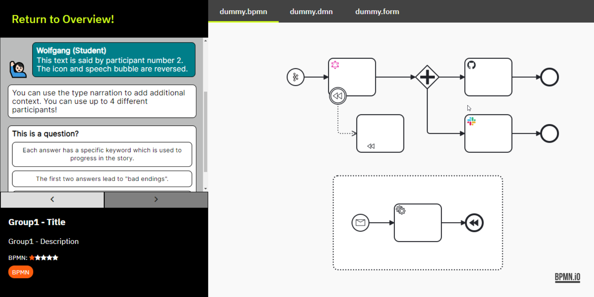
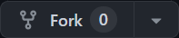
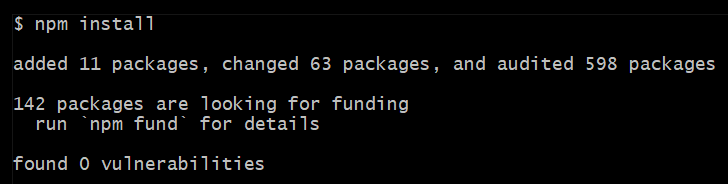
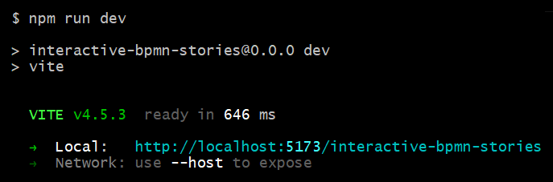
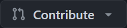

# Interactive BPMN Stories

## Why BPMN Stories?

While BPMN and DMN are easy-to-learn modeling notations, using them to their fullest capacity, as with everything, takes practice.

This webapp provides a framework to create interactive stories that allow teaching either specific features of the modeling languages, or more intricate patterns and use cases.

These stories consist of a messenger-style conversation, and a canvas to display BPMN, DMN and Form files, including the BPMN token simulation to make learning even more easy.



## Example Stories

You can find some example stories in the [Camunda Consulting Github](https://camunda-consulting.github.io/interactive-bpmn-tools/#/bpmn-stories).

## Features

* Create conversations between up to 4 participants + narration
* Use questions and answers to lead the story along different threads
* Display one or more BPMN, DMN and Form files alongside your story
* Conclude your story with good and bad endings

## Technical Details

The stories are configured and described via a TypeScript file. Each story contains two lists of threads: one for messages, one for files. Threads can be used to react to correct/false answers from the user.

Assets are stored in the `/public/` folder and imported from there.

## CamundaCon 2024 - Hackday

### Technical Prerequisites
* Git client
* Github account
* Node.js
* IDE of your choice

### Grab a Copy of the Code
1. [Fork](https://github.com/camunda-community-hub/interactive-bpmn-stories/fork) the repository: 
2. Clone your forked copy: `git clone git@github.com:<YOUR_NAME>/interactive-bpmn-stories.git`.
3. Navigate to the folder: `cd interactive-bpmn-stories`
4. Open the project in your IDE (e.g., `code .` for Visual Studio Code).

### Build & Run the Application
1. Build the application: `npm install`

    This should produce an output similar to this:


2. Run the application: `npm run dev`

    You should get the following output:


3. Open http://localhost:5173/interactive-bpmn-stories in your browser.

### Hack away!

### Publish Your Story
```bash
git add <File>
git commit -m “some commit message”
git push
```

### Create a Pull Request in the Official Repository
1. Create a pull request: 
2. Wait for your story to be merged into the official repository.

### General Tips
* Decide what the Story will be about
  * A BPMN/DMN/Form concept
  * A specific use case
  * An onboarding experience
* Limit the scope (participants, threads)
* Split up the work
* Make use of live editing for frequent testing
* Ask for help if necessary!

### Story Display
The [merged stories](https://camunda-community-hub.github.io/interactive-bpmn-stories) can be viewed on your notebook, tablet or phone:

<p></p>

:warning: On mobile devices touch controls are currently not available.

